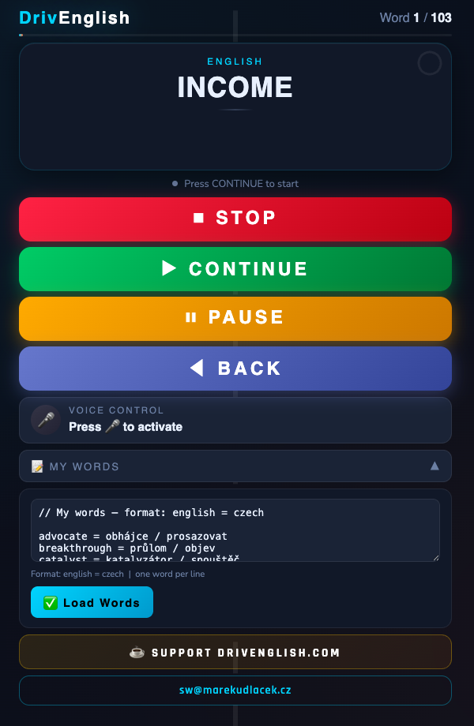

# drivenglish.com

Single-page vocabulary learning app for learning English while driving — plays words aloud (English → Czech) so you can practice hands-free.

🔗 **Live app:** [https://drivenglish.com](https://drivenglish.com)

## Features

- Text-to-speech playback of English words followed by Czech translations
- Voice control (start/stop/pause/next/back) via speech recognition
- Custom word lists — add your own `english = czech` pairs, saved in `localStorage`
- Progress bar and countdown timer for each word
- No build step, no dependencies — a single HTML file (`index.html` / `drivenglish.html`)

## Usage

Open `index.html` in a browser, press **CONTINUE** to start, and use voice commands or the on-screen buttons to control playback.

## Deployment

Static site, deployable to Cloudflare Pages (or any static host). See `_headers` and `_redirects` for Cloudflare-specific configuration.